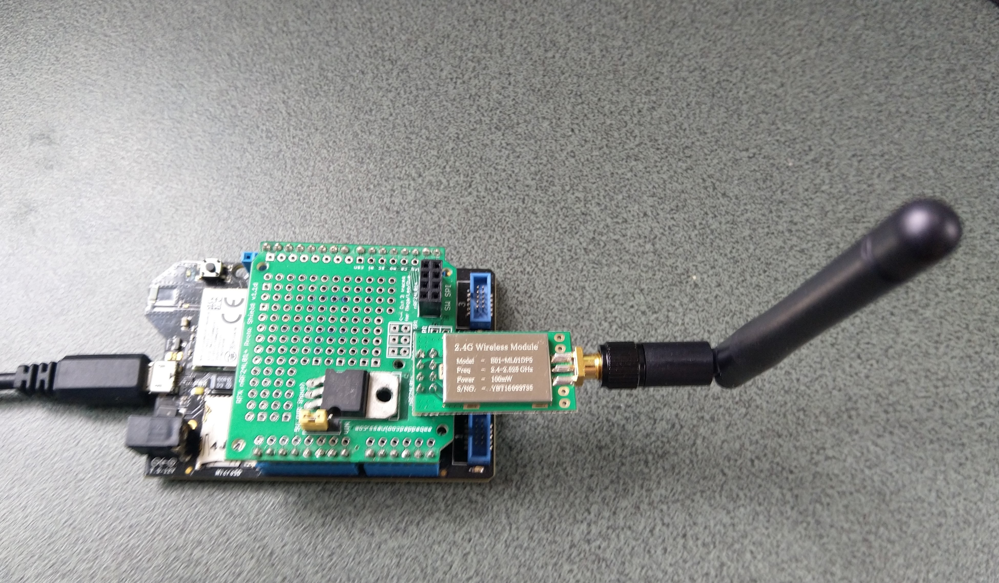

# nRF24L01-NetNF
C# Nordic Semiconductor [nRF24L01](https://www.nordicsemi.com/Products/Low-power-short-range-wireless/nRF24-series) library for
[nanoFramework](https://nanoframework.net/) poweredn devices.

This repo has the source code for the series of blog posts written as I ported [techfooninja/Radios.RF24](https://github.com/techfooninja/Radios.RF24) to nanoFrameworkthe

01. [DeviceSPI](https://blog.devmobile.co.nz/2020/07/29/nanoframework-nrf24l01-library-part1/)
02. [Porting]()

I will add more nanoFramework devices when I can source suitable hardware

[Sample client](https://blog.devmobile.co.nz/) for my Windows 10 IoT Core Field Gateways.
